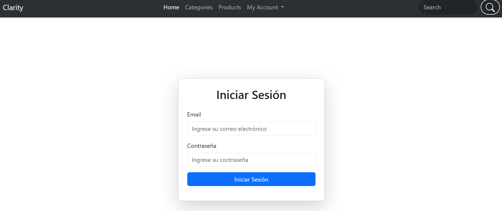

# Clarity - Minimalist Clothing Store



## 🛍️ Project Overview

Clarity is a modern, minimalist e-commerce platform for clothing and accessories developed using Spring Boot. This project showcases a fully functional online store with user authentication, product catalog management, shopping cart functionality, and order processing.

## 🚀 Features

- **User Authentication & Authorization**
  - Secure login/registration system
  - Role-based access control (Admin/User)
  - BCrypt password encryption

- **Product Management**
  - Categorized product listings
  - Advanced search and filtering (by name, category, price)
  - Detailed product pages with size options

- **Shopping Experience**
  - Intuitive shopping cart
  - Order processing system
  - User profile management

- **Admin Panel**
  - Product inventory management
  - Category management
  - User management

## 🛠️ Technologies Used

### Backend
- **Java 17**
- **Spring Boot 3.4.0**
- **Spring Security** - Authentication and authorization
- **Spring Data JPA** - Database access and ORM
- **Hibernate Validator** - Input validation
- **H2 Database** - Embedded database for development

### Frontend
- **Thymeleaf** - Server-side Java template engine
- **Bootstrap 5.3.3** - Responsive UI components
- **HTML/CSS/JavaScript** - Frontend structure and styling
- **jQuery** - DOM manipulation

### Build Tools & Deployment
- **Maven** - Dependency management and build
- **Spring Boot Maven Plugin** - Packaging and running the application

## 🏗️ Architecture

The project follows a typical Spring MVC architecture:

- **Model** - Entity classes (Usuario, Producto, Categoria, Pedido, LineaPedido, etc.)
- **View** - Thymeleaf templates
- **Controller** - Request handling
- **Service** - Business logic
- **Repository** - Data access

## 📂 Project Structure

```
claritySpring/
├── src/
│   ├── main/
│   │   ├── java/
│   │   │   └── com/
│   │   │       └── clarity/
│   │   │           └── spring/
│   │   │               ├── controller/     # Request handlers
│   │   │               ├── model/          # Entity classes
│   │   │               ├── repository/     # Data access interfaces
│   │   │               ├── service/        # Business logic
│   │   │               └── seguridad/      # Security configuration
│   │   └── resources/
│   │       ├── static/
│   │       │   └── images/      # Product images
│   │       └── templates/
│   │           ├── admin/       # Admin panel templates
│   │           ├── Layouts/     # Shared layout templates
│   │           ├── private/     # User-specific pages
│   │           └── public/      # Public pages
│   └── test/
│       └── java/                # Test classes
└── pom.xml                      # Maven configuration
```
## 🚀 Getting Started

### Prerequisites
- Java 17 or higher
- Maven

### Running the Application

1. Clone the repository:
   ```bash
   git clone https://github.com/danielgil-dev/claritySpring.git
   cd claritySpring
   ```

2. Build the project:
   ```bash
   mvn clean install
   ```

3. Run the application:
   ```bash
   mvn spring-boot:run
   ```

4. Access the application at: `http://localhost:8080/index`

### Default Admin Credentials
- Email: danielAdmin@gmail.com
- Password: admin123

## 💡 Key Learning Points

This project demonstrates proficiency in:

- Spring Boot application development
- Spring Security implementation for authentication and authorization
- Database modeling with Spring Data JPA
- Thymeleaf template integration
- Building a complete e-commerce platform from scratch
- Role-based access control
- Form validation with Hibernate Validator

## 🔮 Future Enhancements

- Payment gateway integration
- Product reviews and ratings system
- Wishlist functionality
- Email notifications
- Advanced analytics
- Mobile responsiveness improvements

## 👨‍💻 Author

**Daniel Gil** - [GitHub Profile](https://github.com/danielgil-dev)
---

